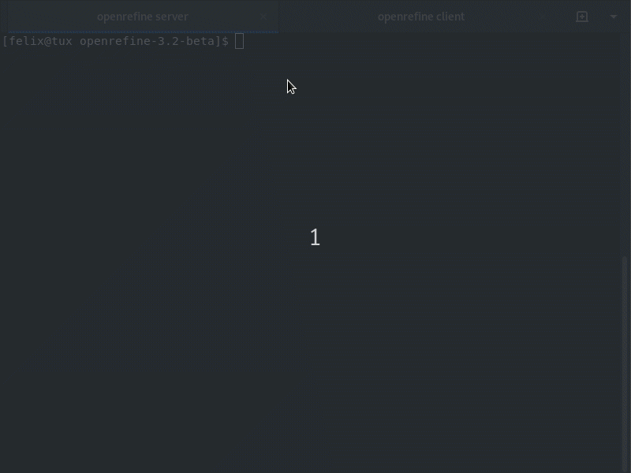

# Automatisierte Datenverarbeitung mit OpenRefine
Hands-On-Tutorial, DINI AG KIM Workshop am 2./3.4.2019 in Mannheim

Dieses Tutorial lässt sich auch Zuhause nachspielen:

1. [Server installieren](server-installieren.md)
2. [Präsentation](praesentationsfolien.pdf) anschauen
3. [Handout Teil 1](handout-teil1.md) durchspielen
4. Handout Teil 2 durchspielen (folgt)

## Vorschau

Kleines Video, worum es im Workshop geht (ca. 3 Minuten im Loop):

## Abstract

Die Software OpenRefine ist bekannt für ihre grafische Oberfläche, die einem Tabellenverarbeitungsprogramm ähnelt. Sie wird oft als Desktop-Software installiert und zur Analyse und Bereinigung von heterogenen Daten eingesetzt (siehe auch [Präsentation von Maike Kittelmann auf KIM WS 2016](https://github.com/mkittelmann/presentations/blob/master/open_refine_for_kim_final.pdf)). Weniger bekannt sind die Automatisierungsmöglichkeiten von OpenRefine. Durch die Client-Server-Architektur lässt sich OpenRefine auch auf einem Webserver installieren und über die Kommandozeile steuern. Das hat den Charme, dass Transformationsregeln in der Oberfläche spielerisch erprobt werden können und dann beispielsweise täglich automatisiert auf neue Datenlieferungen angewendet werden können.

**Zielgruppe:** Personen, die gelegentlich mit OpenRefine arbeiten und Automatisierungsmöglichkeiten kennenlernen möchten.

**Vorkenntnisse:** Vorerfahrungen mit OpenRefine sind hilfreich, aber nicht erforderlich.

**Voraussetzungen:**  Ein Notebook mit Windows, MacOS oder Linux. Es muss keine Software  vorab installiert werden, da ein Webserver mit OpenRefine für alle  TeilnehmerInnen bereitgestellt wird. Es sind keine Programmierkenntnisse  erforderlich, die nötigen Schritte werden einzeln demonstriert.

## Quellenangaben für mitgelieferte Dateien

* `powerhouse.tsv`: https://programminghistorian.org/en/lessons/cleaning-data-with-openrefine, CC by sa 2.5 Australia
* `doaj-article-sample.csv`: https://librarycarpentry.org/lc-open-refine/setup.html
* `openrefine-client_0-3-4_linux-64bit`, `openrefine-client_0-3-4_mac` und `openrefine-client_0-3-4_windows.exe`: https://github.com/opencultureconsulting/openrefine-client, GPLv3
